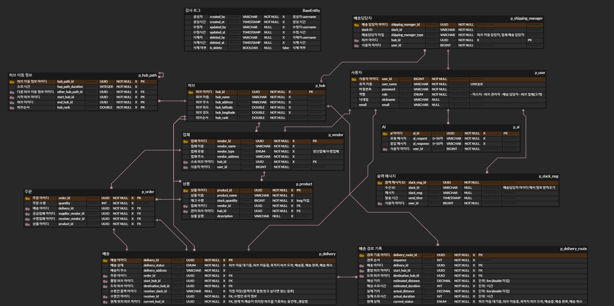
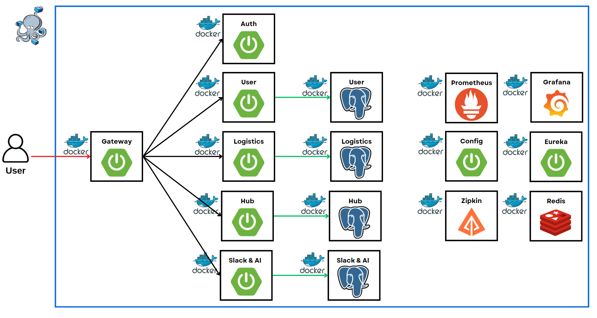

# MSA 물류 프로젝트
- MSA 기반 물류 관리 및 배송 플랫폼

## 🐹 개발 환경

| 분류       |  상세                                  |
|------------|:------------------------------------|
| IDE        | `IntelliJ`                           |
| Language   | `Java 17`                           |
| Framework  | `Spring Boot 3.3.3`, `Spring Security` |
| Database   | `PostgreSQL`, `Redis` |
|ORM         | `JPA` |
| Build Tool | `Gradle`                          |
| Infra      | `Docker`, `Docker-Compose`        |
|Monitoring  |`zipkin`, `prometheus`, `Grafana` |
|Version control|`git`, `github`|

 

## 🧩 ERD 및 테이블 명세서

- [[테이블 명세서 보러가기]](https://www.notion.so/teamsparta/fa7f938fb7554cf884904d99c95c8ca5)

 

## 🐙 API docs

- [[보러 가기]](https://www.notion.so/teamsparta/API-f7da2a7b7fe64f9c9eeb8616fd15e9f4) (스웨거 삽입 예정)
 

## 🐬 인프라 구조

## 📂 패키지 구조

| Service	             | Description	    | Authorization	 | Port   |
|:---------------------|:----------------|:---------------|:-------|
| [`Eureka`]           | 서비스 등록 및 로드밸런싱|       | `19090` |
| [`Gateway`]          | 요청 인증 및 라우팅     | jwt 토큰 인증      | `19095` |
| [`Auth`]             | jwt 토큰 발급 및 관리     | jwt 토큰 발급      | `19096` |
| [`User`]             | 사용자 관련 작업 관리   | jwt 토큰 인가      | `19094` |
| [`Hub`]              | 허브, 업체 도메인 작업 관리|jwt 토큰 인가    | `19092` |
| [`Logistics`]        | 물류(상품, 주문, 배송) 도메인 작업 관리|jwt 토큰 인가 | `19091` |
| [`AI`]               | AI, Slack 메세지 도메인 작업 관리|jwt 토큰 인가       | `19093` |

## 실행 순서
- Eureka  → gateway  → Auth  → User, Hub, Logistics, AI

## DB port 번호
- Logistics → 5433
- Hub → 5434
- Slack & AI → 5435
- User → 5436

## 팀원 소개 및 파트 분배

| 팀원   | 담당 파트                                               |
|-------|:-------------------------------------------------|
| [곽솔래](https://github.com/lossol1)   | 업체, 허브                                          |
| [이경진](https://github.com/kyungjinleelee)   | 상품, 상품 AI, 주문, 분산추적                                        |
| [최준](https://github.com/CJ-1998)    | 유레카, 게이트웨이, Auth 및 유저 + Slack + AI |
| [노민경](https://github.com/minjjings)   | 배송 (배송, 배송 경로 기록)                                |
| 공통    | 프로메테우스, Zipkin, Resilience4j                             |

# 🌊흐름 및 엔티티

A 업체에서 주문 -> B 업체에 재고 확인 -> 주문, 배송 생성 (배송 메시지 저장)

-> B 업체 상품 재고 수정 -> B 업체 담당 허브 찾기

-> 배송 담당자 배정 (6시에 배송 메시지 전송) -> 허브 간 이동 -> 허브에서 업체로 이동
